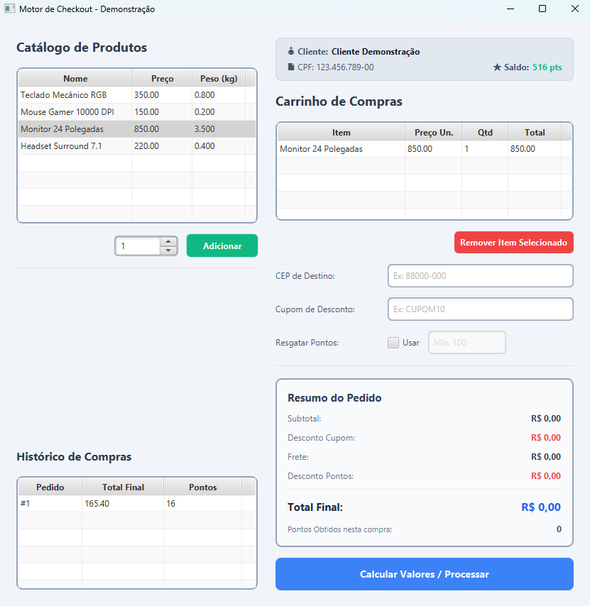

# E-Commerce Checkout Engine



## Integrantes
* [Matheus Picolli Ishibashi](https://github.com/MPicolli)
* [Vithor Massing dos Santos](https://github.com/VithorSantos)
* [José Augusto Ferreira](https://github.com/testerapido157-star)
* [Eric Levi Sena Silveira](https://github.com/ezlss)
* [Leonardo de Medeiros Binatti](https://github.com/BinattiLeonardo)

## Descrição do Projeto
Trabalho desenvolvido para a disciplina de Qualidade de Software na Unisul 2026/1. Este projeto consiste em um motor de processamento de checkout via interface gráfica em JavaFX, focado na validação rigorosa de testes unitários e regras de negócio em um sistema de vendas. 

O objetivo principal é a construção de uma arquitetura resiliente e altamente testável. O sistema lida com cenários reais de entrada de usuário, como validação de cupons (validade e valor mínimo), cálculo dinâmico de frete por CEP, identificação de clientes com sistema de pontos de fidelidade, histórico completo das transações efetuadas, carrinho de compras e gerenciamento de produtos a partir de listas com itens pré-definidos . A garantia de qualidade é assegurada por uma ampla suíte de testes unitários que cobrem tanto o "caminho feliz" quanto cenários de exceção e análise de valor limite.

## Tecnologias Utilizadas
* **Linguagem:** Java 23.0.2
* **Interface:** JavaFX & FXML
* **Gerenciador de Dependências:** Apache Maven 3.9.16
* **Framework de Testes:** JUnit 5
* **Simulação de Dependências:** Mockito
* **Métrica de Cobertura:** JaCoCo (Java Code Coverage)

## Pré-requisitos
Antes de começar, certifique-se de ter instalado em sua máquina:
* **Java JDK 23**
* **Apache Maven** (versão 3.9 ou superior)
* **Git**

## Instalação e Execução
Siga os passos abaixo para clonar, compilar e executar o projeto em sua máquina local.

### Tutorial Youtube:
https://youtu.be/a6EGMguTojE

### 1. Clonar o Repositório
Abra o terminal na pasta onde deseja salvar o projeto e clone o repositório principal:

* **Clone o repositório:** git clone https://github.com/MPicolli/ecommerce-checkout-engine.git

* **Ir para a pasta raiz:** Com o projeto aberto em uma IDE, abra um terminal dentro da IDE e vá para a pasta raiz digitando o comando: **cd ecommerce-checkout-engine**

### 2. Instalar Dependências e Executar Testes
Com os pré-requisitos instalados o Maven baixará automaticamente o JavaFX, as ferramentas de teste, vai compilar o código, executar a suíte de testes unitários e gerar o relatório de cobertura do JaCoCo ao rodar o comando abaixo. 

* **Execute o comando dentro do terminal:** ```mvn clean test```

Após a execução, o relatório detalhado de cobertura de testes estará disponível no caminho: ecommerce-checkout-engine/target/site/jacoco/index.html

### 3. Iniciar a Interface Gráfica
Para abrir a janela do Motor de Checkout e interagir com o sistema:

*  **Execute o comando dentro do terminal:** ```mvn javafx:run```

## Workflow de Versionamento
Adotamos o GitHub Flow para o desenvolvimento do projeto.

### Estrutura de Branches
* `main`: contém a versão estável do sistema
* `feature/nome-da-feature`: utilizada para desenvolvimento de novas funcionalidades, criadas a partir da `main`

### Fluxo de Trabalho
1. Criar uma branch a partir da `main`
2. Desenvolver a funcionalidade na branch criada
3. Realizar commits seguindo o padrão Conventional Commits
4. Abrir um Pull Request (PR) para a branch `main`
5. Outro integrante revisa o código
6. Após aprovação, realizar o merge na `main`

## Padrão de Commits
Adotamos o padrão Conventional Commits para manter o histórico organizado e compreensível.

### Tipos de commit utilizados:
* `feat`: nova funcionalidade
* `fix`: correção de bug
* `docs`: alterações na documentação
* `test`: criação ou alteração de testes
* `refactor`: melhoria no código sem alterar comportamento
* `chore` : tarefas de manutenção, configurações de build ou dependências

### Exemplos:
* `feat: adiciona cálculo de frete`
* `fix: corrige validação de cupom expirado`
* `docs: atualiza README com workflow`
* `test: adiciona testes do checkout`
